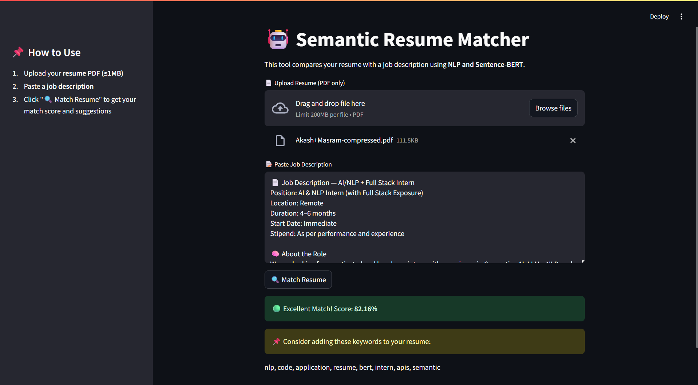

# 🤖 Semantic Resume Matcher

A Streamlit-based web application that uses **Natural Language Processing (NLP)** and **Sentence-BERT embeddings** to compare a user's resume with a job description. The tool returns a semantic similarity score and suggests missing keywords to improve your resume.

## Screenshots



---

## 🚀 Features

* Upload **PDF resume** (max 1 MB)
* Paste job description
* Preprocess and lemmatize text using **spaCy**
* Generate embeddings using **Sentence-BERT (MiniLM-L6-v2)**
* Compute **cosine similarity** for match scoring
* Extract and compare **TF-IDF-based keywords**
* Display visual feedback and suggestions via Streamlit

---

## 🧠 Architecture 

```
User Input (PDF + JD)
        ↓
   Streamlit UI
        ↓
Text Preprocessing (spaCy)
        ↓
Embeddings (Sentence-BERT)
        ↓
Cosine Similarity Score
        ↓
TF-IDF Keyword Comparison
        ↓
Match Score + Missing Keywords
        ↓
    Visual Output
```

---

## 🧰 Tech Stack

| Layer       | Tool/Library                |
| ----------- | --------------------------- |
| UI          | Streamlit                   |
| NLP         | spaCy, SentenceTransformers |
| Embedding   | all-MiniLM-L6-v2            |
| PDF Parsing | pdfplumber                  |
| ML Utils    | scikit-learn, PyTorch       |
| Language    | Python                      |

---

## 📦 Installation

```bash
# Create virtual environment (optional)
python -m venv venv
source venv/bin/activate  # or .\venv\Scripts\activate on Windows

# Install dependencies
pip install -r requirements.txt
python -m spacy download en_core_web_sm
```

---

## ▶️ Run the App

```bash
streamlit run app.py --server.fileWatcherType none
```

> ⚠️ Use the `--server.fileWatcherType none` flag to avoid PyTorch/Streamlit crashes on Windows.

---

## 📂 Folder Structure

```
resume-matcher-semantic/
├── app.py              # Main Streamlit app
├── utils.py            # Text processing, similarity, and keyword functions
├── requirements.txt    # All dependencies
├── README.md           # Project description and guide
```

---

## 💡 Future Improvements

* Add support for multiple job descriptions
* Export keyword suggestions as PDF
* Model selector: TF-IDF vs BERT vs GPT embeddings

---

## 📄 License

This project is open source and free to use under the [MIT License](LICENSE).
